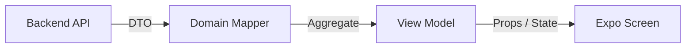

# Phanda Frontend Architecture

This document describes the design patterns and frontend architecture of the iPhande mobile application. The architecture is designed to scale clean code, isolate network boundary changes, and maintain high performance.

---

## 1. Core Architectural Pillars

### I. Feature Module Grammar
The app is organized into isolated, self-contained business modules inside `src/features/` (e.g. `quote`, `lead`, `opportunity`, `business`, `dashboard`). Each module follows a strict sub-directory and barrel export pattern:

```
src/features/opportunity/
├── api/             # Private: generated queries or domain-specific REST/GraphQL calls
├── components/      # Private: domain-specific UI components
├── hooks/           # Public: React Query query/mutation hooks
├── mappers/         # Private: Domain DTO-to-Aggregate-to-ViewModel mappers
├── types/           # Public: Aggregate and ViewModel TypeScript definitions
└── index.ts         # Public Barrel: The ONLY allowed entry point for other modules and screens
```

### II. Aggregate & View Model Separation
Following Domain-Driven Design (DDD) principles:
1. **Network DTOs**: Unstable types directly generated from the backend API schema.
2. **Domain Aggregate Roots**: Stable, unified business entities that contain the core rules and status logic (e.g. `QuoteAggregate` containing a canonical 7-state `QuoteStatus`).
3. **View Models**: Screen-tailored data structures representing exactly what the UI needs to render (e.g. `QuoteCardViewModel` containing pre-formatted monetary strings like `R 1,250.00` and date formats).

Screens **MUST NEVER** consume generated DTOs directly. They consume View Models projected from Aggregates via pure-function mappers.



### III. DTO Isolation
To prevent backend API schema changes from breaking the entire application:
- All generated REST clients and TypeScript schemas live in `src/generated/`.
- **Rule:** Screens and screens-level components are strictly prohibited from importing from `src/generated/*`. They can only import domain aggregates, view models, and hooks from the public feature barrels (e.g. `@/features/quote`).
- This isolates the network layer, ensuring api upgrades only require updating the Mapper function.

### IV. Cross-Domain Cache Management
We use React Query to manage server state. When a mutation executes, it must invalidate query keys according to a strict cache contract (defined in `governance-architecture/CACHE_CONTRACT.md`).
- Mutations in one engine can invalidate queries owned by another engine (cross-domain invalidation).
- For example, `useSendQuote` (Quote Engine) invalidates the `inbox()` query key owned by the Lead Engine, transitioning the originating lead to "Quoted" status.

---

## 2. Directory Structure

```
├── app/                      # Expo Router routing directory (Screens only)
├── src/
│   ├── api/                  # Base API configuration, Supabase & storage clients
│   ├── components/steward/   # Shared presentation components
│   ├── config/               # Base environment constants
│   ├── features/             # Feature Module folder (Domain Core)
│   ├── generated/            # Orval generated REST endpoints & DTO models
│   ├── shared/               # Cross-domain query keys and utility scripts
│   └── utils/                # Pure formatting and calculation helpers
├── governance-architecture/  # Architectural guidelines, constitution, and historical baselines
└── scripts/                  # Automated verification and linting tools
```

---

## 3. Automated Verification

We enforce these architectural rules using a custom Python script: `python scripts/audit_architecture.py`.

The script automatically checks:
- **Barrel Exports**: Asserts that every feature module has an `index.ts` barrel, a `types` layer, and a `hooks` layer.
- **DTO Leakage**: Scans screens in `app/` to ensure no imports originate from `src/generated/` or use direct DTO types.
- **No Direct Fetching**: Ensures screens do not call native `fetch()` or legacy `fetchWithAuth()` directly, enforcing the use of React Query hooks.
- **Deep Feature Imports**: Screens are prohibited from importing deeper than the feature barrel (e.g. `@/features/quote/hooks/useQuote` is blocked, only `@/features/quote` is allowed).
