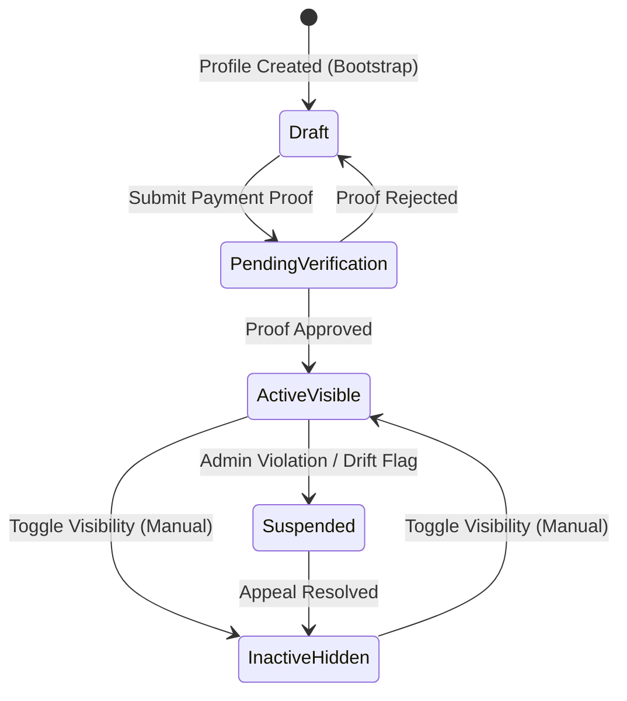
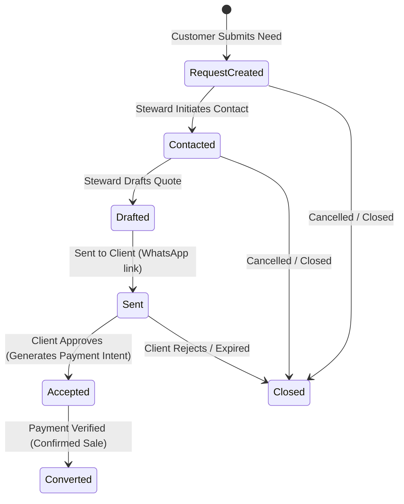
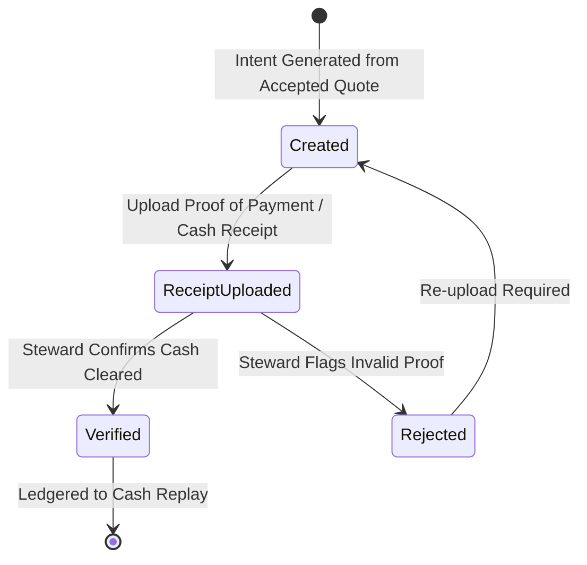
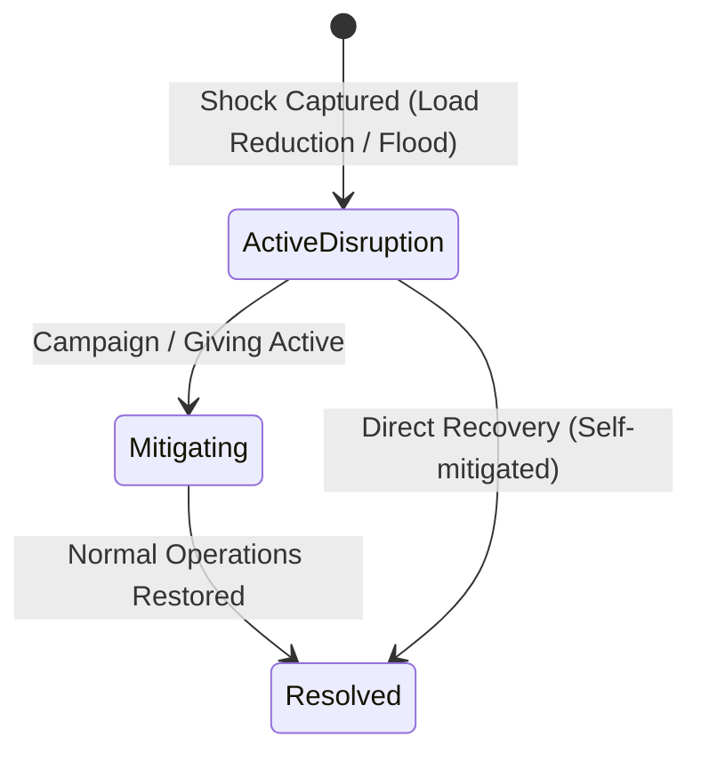

# State Transitions: The Executable Ecosystem

This document defines the lifecycle states and transitions of the core entities in the iPhande system. These transitions govern how the ecosystem executes its laws and preserves its memory.

---

## 1. Steward Profile Lifecycle

A profile tracks the transition of a physical steward from raw onboarding to verified community visibility.

### Transition Triggers:
* **Bootstrap:** `POST /profiles/bootstrap` creates the initial `Draft` state.
* **Submit Payment Proof:** `POST /me/payment-proof` moves the state to `PendingVerification`.
* **Admin Review:** 
  * `POST /admin/profiles/{profile_id}/approve-payment` transitions state to `ActiveVisible` and triggers baseline trust recalculation.
  * `POST /admin/profiles/{profile_id}/reject-payment` returns state to `Draft`.
* **Manual Toggle:** `PATCH /profiles/{profile_id}/visibility` transitions between `ActiveVisible` and `InactiveHidden`.

---

## 2. Transaction Pipeline (Quote Requests & Quotes)

This state machine controls the transaction flow, translating a customer's physical need into a finalized financial event.

### Transition Triggers:
* **Create Request:** `POST /api/v1/quote-requests` creates a `RequestCreated` ticket.
* **Initiate Contact:** `POST /api/v1/quote-requests/{id}/contact` marks it as `Contacted`.
* **Draft Quote:** `POST /api/v1/quote-requests/{id}/quotes` creates a `Drafted` quote mapping materials and labor.
* **Send Quote:** `POST /api/v1/quotes/{id}/send` marks it as `Sent` and generates the WhatsApp web link.
* **Accept Quote:** `POST /api/v1/quotes/{id}/accept` transitions it to `Accepted`, automatically creating a `PaymentIntent`.
* **Confirm Sale:** `POST /api/v1/quote-requests/{id}/confirm-sale` transitions state to `Converted` upon payment verification.

---

## 3. Payment Intent Lifecycle

Since cash and external e-wallet swaps are standard, payment intents track the proof of settlement before they are written to the permanent ledger.

### Transition Triggers:
* **Create Intent:** `POST /api/v1/quotes/{id}/payment-intents` or `POST /api/v1/payments/intents` sets status to `Created`.
* **Upload Proof:** `POST /api/v1/payments/intents/{id}/receipt-upload` or `POST /api/v1/payments/intents/{id}/proofs` transitions to `ReceiptUploaded`.
* **Verify Payment:** `POST /api/v1/payments/intents/{id}/verify` checks the cash/clearing state, transitions to `Verified`, and issues the automated receipt `POST /api/v1/payments/intents/{id}/receipt`.
* **Reject Payment:** `POST /api/v1/payments/intents/{id}/reject` returns the intent to `Created`.

---

## 4. Continuity & Disruption Lifecycle

This lifecycle tracks systemic shocks, ensuring that the impact graph and community recovery responses are fully coordinated.

### Transition Triggers:
* **Log Crisis:** `POST /api/v1/continuity-events/` creates an `ActiveDisruption` node.
* **Launch Support:** `POST /api/v1/campaigns` transitions the state to `Mitigating`, activating peer-to-peer giving pools (`POST /api/v1/giving/`).
* **Restore Operations:** Updating the event status to closed transitions it to `Resolved`, returning the steward's status to fully available (`GET /api/v1/availability/{profile_id}`).